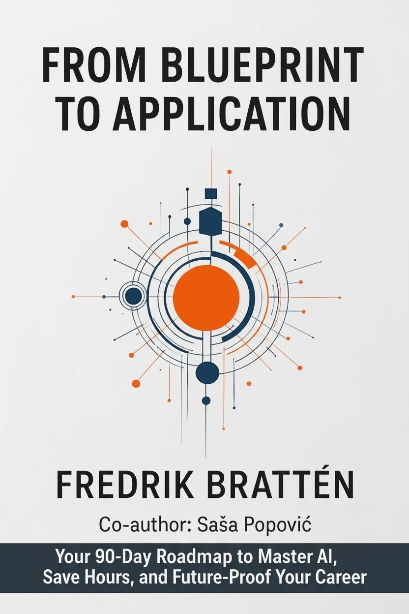

# From Blueprint to Application

> **Embark on a 90-Day Journey to Master AI and Future-Proof Your Career**

[](#license)
[](https://fbratten.github.io/From-Blueprint-to-Application)
[](https://subscribepage.io/from-blueprint-to-application)

---

<p align="center">
  
</p>

<p align="center">
  <strong>The Complete Guide to Enterprise Prompt Engineering</strong><br>
  <em>By Fredrik Brattén & Saša Popović</em>
</p>

---

## About the Book

Transform frustrating AI trial-and-error into consistent, time-saving workflows that actually deliver on AI's promise. This comprehensive guide takes you from AI beginner to enterprise prompt engineering professional through a structured 90-day learning journey.

### What You'll Achieve

- **Save 5+ hours weekly** on routine tasks through optimized AI workflows
- **Build a personal library** of 20+ battle-tested prompt templates
- **Master enterprise requirements** including security, compliance, and governance
- **Create AI-powered applications** that scale across your organization
- **Become the AI expert** your team relies on for guidance

---

## Book Structure

The book follows **Sarah's journey**—a professional who discovers prompt engineering and transforms her organization's approach to AI. Her story weaves through all 12 chapters, making complex concepts relatable and actionable.

### Part I: Foundations of Prompt Engineering
| Chapter | Focus |
|---------|-------|
| **1** | The Art and Science of AI Communication |
| **2** | Building Blocks of Professional Prompts |

### Part II: The Enterprise Prompt Library
| Chapter | Focus |
|---------|-------|
| **3** | Establishing a Centralized Prompt Library |
| **4** | Security, Compliance, and Prompt Management |

### Part III: Engineering in Practice
| Chapter | Focus |
|---------|-------|
| **5** | Domain-Specific Prompt Applications |

### Part IV: Advanced Techniques
| Chapter | Focus |
|---------|-------|
| **6** | Advanced Prompt Engineering Techniques |
| **7** | Esoteric Examples and Paradigm Shifts |
| **8** | From Prompt to Product - Scaling Enterprise Solutions |

### Part V: Implementation Roadmap
| Chapter | Focus |
|---------|-------|
| **9** | Getting Started - Your 90-Day Plan |
| **10** | The Future of Prompt Engineering |

### Part VI: Infrastructure Evolution
| Chapter | Focus |
|---------|-------|
| **11** | Model Context Protocol (MCP) - Living Intelligence |
| **12** | From Assistants to Collaborators - Building AI Agents |

**Plus:** 5 comprehensive appendices with templates, tools, glossary, and reference guides.

---

## Interactive Demos

Try these interactive tools to experience concepts from the book:

| Demo | Description | Try It |
|------|-------------|--------|
| **Prompt Builder** | Construct well-structured prompts using proven frameworks | [Launch →](demos/prompt-builder/) |
| **Model Selector** | Find the right AI model for your use case | [Launch →](demos/model-selector/) |
| **Token Calculator** | Estimate API costs and context window usage | [Launch →](demos/token-calculator/) |
| **Enterprise Flow** | Visualize the 90-day implementation journey | [Launch →](demos/enterprise-flow/) |
| **Injection Detection** | Learn to identify prompt injection vulnerabilities | [Launch →](demos/injection-detection/) |
| **Few-Shot Builder** | Create example-based prompts for consistent outputs | [Launch →](demos/few-shot-builder/) |

---

## Who This Book Is For

<table>
<tr>
<td width="33%" valign="top">

### Beginners
*New to AI*

- Learn fundamentals from scratch
- Build your first prompt templates
- Save time on daily tasks
- Understand AI capabilities

</td>
<td width="33%" valign="top">

### Intermediate
*Team Leads & Managers*

- Standardize AI usage
- Create team prompt libraries
- Implement governance
- Scale best practices

</td>
<td width="33%" valign="top">

### Professionals
*IT Directors & Leaders*

- Drive transformation
- Architect enterprise AI
- Build autonomous systems
- Future-proof strategy

</td>
</tr>
</table>

---

## The 90-Day Journey

```
Week 1-4: FOUNDATION
├── Master prompt fundamentals
├── Build your first 10 templates
└── Establish personal workflows

Week 5-8: SCALING
├── Create team prompt library
├── Implement security practices
└── Domain specialization

Week 9-12: OPTIMIZATION
├── Advanced techniques
├── Enterprise integration
└── Autonomous systems
```

---

## Documentation

- [Book Overview](docs/overview.md)
- [Chapter Summaries](docs/chapters/)
- [Key Concepts](docs/concepts/)
- [Glossary](docs/resources/glossary.md)
- [Templates & Resources](docs/resources/)

---

## Pre-Release Offer

Get early access at **40% off** the regular price.

**Early Access: 249 SEK** (Regular: 399 SEK)

[→ Reserve Your Copy](https://subscribepage.io/from-blueprint-to-application)

---

## Connect

- **Author:** Fredrik Brattén
- **Co-Author (Chapter 12):** Saša Popović
- **Contact:** [GitHub](https://github.com/fbratten)

---

## License

Copyright © 2026 Fredrik Brattén. All Rights Reserved.

This showcase repository contains promotional materials and interactive demos for educational purposes. The full book content is protected by copyright.

---

<p align="center">
  <em>"The best time to master AI was yesterday. The second best time is today."</em>
</p>
